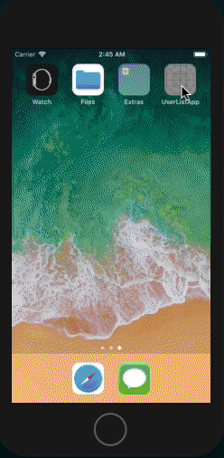

# UserList
UserList is a example for ReactComponentKit. It is focus on requesting api asynchronously.



## Completed

- [x] Load Users
- [x] Delete User
- [x] Update User
- [x] Add New User
- [x] Make and Show Loding Component when app is requesting an api.
- [x] Make and Show Error Component when the app has occurred some error.


## Define Actions

We'll define four actions for UserList app. 

### LoadUsersAction

It loads user list from `https://jsonplaceholder.typicode.com` REST api. 

```swift
struct LoadUsersAction: Action {
    
}
```

### AddNewUserAction

It adds the new user to `https://jsonplaceholder.typicode.com` server.

```swift
struct AddNewUserAction: Action {
    let user: User
    
    init(user: User) {
        self.user = user
    }
}
```

### UpdateUserAction

It updates the current user's attribute to `https://jsonplaceholder.typicode.com` server.

```swift
struct UpdateUserAction: Action {
    
    let user: User
    
    init(user: User) {
        self.user = user
    }
}
```

### DeleteUserAction

It deletes a user from `https://jsonplaceholder.typicode.com` server.

```swift
struct DeleteUserAction: Action {
    let user: User
    
    init(user: User) {
        self.user = user
    }
}
```

## Define State, ViewModel and Action Flow

`loadUsers` and other reducers are the async reducer. Async reducer can run itself on await or async manner.

```swift
enum ViewState {
    case none
    case loading
    case requesting
    case list
    case error
}

struct UserListState: State {
    var viewState: ViewState = .none
    var users: [User] = []
    var sections: [DefaultSectionModel] = []
    var error: RCKError? = nil
}

class UserListViewModel: RCKViewModel<UserListState> {
    
    let viewState = Output<ViewState>(value: .loading)
    let sections =  Output<[DefaultSectionModel]>(value: [])
    
    override func setupStore() {
        initStore { store in
            store.initial(state: UserListState())
            store.beforeActionFlow(logAction)
            
            store.flow(action: LoadUsersAction.self)
                .flow(
                    awaitFlow(loadUsers),
                    { state, _ in makeCollectionViewSectionModels(state: state) }
                )
            
            store.flow(action: AddNewUserAction.self)
                .flow(
                    awaitFlow(addNewUser),
                    { state, _ in makeCollectionViewSectionModels(state: state) }
                )
            
            store.flow(action: DeleteUserAction.self)
                .flow(
                    awaitFlow(deleteUser),
                    { state, _ in makeCollectionViewSectionModels(state: state) }
                )
            
            store.flow(action: UpdateUserAction.self)
                .flow(
                    awaitFlow(updateUser),
                    { state, _ in makeCollectionViewSectionModels(state: state) }
                )
        }
    }
        
    override func on(newState: UserListState) {
        sections.accept(newState.sections)
        viewState.accept(.list)
    }
    
    override func on(error: RCKError) {
        viewState.accept(.error)
    }
    
    
    func newUser() -> User {
        return withState { state in
            let id = state.users.count + 1
            let name = "\(Faker().name.firstName()) \(Faker().name.lastName())"
            let username = Faker().name.name()
            let email = Faker().internet.email()
            let phone = Faker().phoneNumber.phoneNumber()
            return User(id: id, name: name, username: username, email: email, phone: phone)
        }
    }
}
```

## The MIT License 

MIT License

Copyright (c) 2018 Sungcheol Kim, https://github.com/ReactComponentKit/UserList

Permission is hereby granted, free of charge, to any person obtaining a copy
of this software and associated documentation files (the "Software"), to deal
in the Software without restriction, including without limitation the rights
to use, copy, modify, merge, publish, distribute, sublicense, and/or sell
copies of the Software, and to permit persons to whom the Software is
furnished to do so, subject to the following conditions:

The above copyright notice and this permission notice shall be included in all
copies or substantial portions of the Software.

THE SOFTWARE IS PROVIDED "AS IS", WITHOUT WARRANTY OF ANY KIND, EXPRESS OR
IMPLIED, INCLUDING BUT NOT LIMITED TO THE WARRANTIES OF MERCHANTABILITY,
FITNESS FOR A PARTICULAR PURPOSE AND NONINFRINGEMENT. IN NO EVENT SHALL THE
AUTHORS OR COPYRIGHT HOLDERS BE LIABLE FOR ANY CLAIM, DAMAGES OR OTHER
LIABILITY, WHETHER IN AN ACTION OF CONTRACT, TORT OR OTHERWISE, ARISING FROM,
OUT OF OR IN CONNECTION WITH THE SOFTWARE OR THE USE OR OTHER DEALINGS IN THE
SOFTWARE.